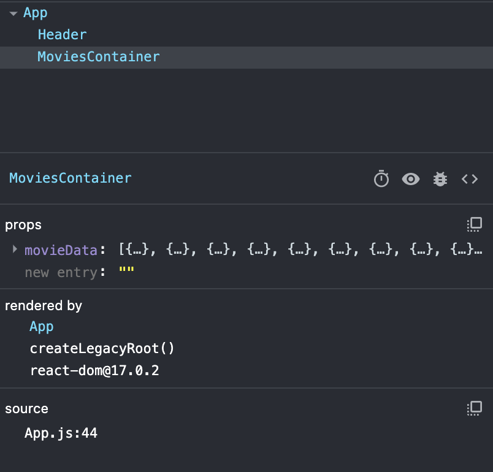
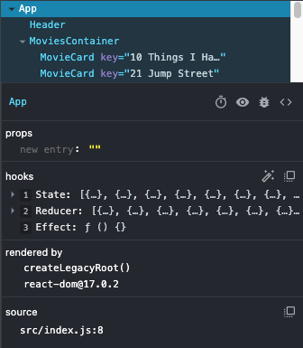
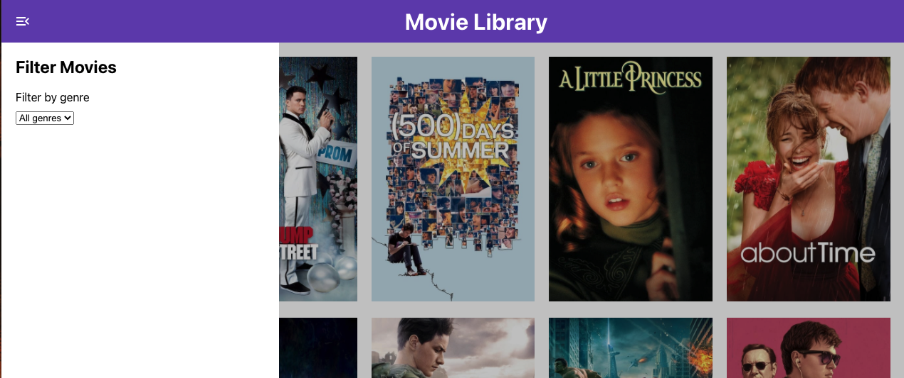

# CoderGirl-Frontend_Studio-11-12

This studio is based off section 10 of your Udemy course - useEffect, useReducer and the Context API. This studio is built to be completed over 2 class periods. As of 9/15/21, I've only prepared the first class's studio.
I've also added some practice and new skills for common use cases you'll experience when working.

You are building a Movie Library. You'll first fetch data from a separate source, then display the data in a series of components. You'll also add logic to filter the movies shown based on what genre the user selects.


## Getting Started

### A. Fork & clone the repository from GitHub.

- [ ] Navigate to the [CoderGirl-FrontEnd_Studio-11-12 project repository](https://github.com/kirbykatie/CoderGirl-Frontend_Studio-11-12).
- [ ] Fork the repository to your own account, then grab the link from the green Code dropdown.
- [ ] In your terminal, go to the folder where you want your project to be. Use git clone to create your local copy.

### B. Get the project ready to code.

- [ ] In VSCode (or the IDE of your choice), open the project so you can view the code. You should already be in the main branch, which is where the starter code resides.
- [ ] Open a terminal inside your VSCode. Your terminal should already be inside the CoderGirl-FrontEnd_Studio6 directory. Then use the command npm install to download any required dependencies.
- [ ] Now use the command npm start to serve the project to your browser. You should see a purple bar at the top that says 'Movie Library' and a menu open icon.

## Part 1 - Fetching Movie Data & Displaying It

### A - Fetching Data

In many web apps, you'll need to fetch data from another source - whether it be your project's backend service, a 3rd-party source, or something else. We want to put this fetch inside a `useEffect()` hook that only runs **once**. If the fetch is outside of the useEffect, the data saved to state will trigger a re-render, which will cause the app to fetch the data again and save it to state, and thus creating an infinite loop. The `staticMovieData` state variable has already been created for you

- [ ] Create a useEffect() that runs once. Inside the body, fetch from the following URL: `https://getpantry.cloud/apiv1/pantry/5daec432-c358-442e-bbac-be944968a126/basket/movies`. Recall there's 2 steps when handling the data received from a fetch. The code will look like this:

```javascript
fetch(url)
   .then(res => res.json())
   .then(res => console.log(res)) //or do whatever you want to the data
   .catch(err => console.error(err => console.error(err));  //It's always good to add error handling when dealing with external calls
```

- [ ] Once the data is received, save it to the `staticMovieData` variable. IMPORTANT - the data received from the API is actually {movieData: []} instead of just the array of elements. However, we want the array to be saved to state, not the object holding the array. Make sure to use `response.movieData` when setting your state.
- [ ] Check your work. When you look at the React Dev Tools, do you see a state variable of an array with 66 elements?
- [ ] Take a look at the data we're getting from the API - it's pretty complex! We'll be using it as we go through both studios. _Note: This data, including the images, have all been taken as-is from [The Movie Database](https://www.themoviedb.org/documentation/api). I have not made any changes to it._

### B - Setting up the Movie Container

There is a `MovieContainer` component file already created. This component will hold all the MovieCards that represent each movie.

- [ ] Import the `MovieContainer` component into the `App.js` file.
- [ ] In App's `return` JSX, under `<Header />`, add the `MovieContainer` component to the JSX. Pass one prop in `movieData` that will be equal to `staticMovieData`. Note: As we go through this studio, the value we're passing as `movieData` will change!
- [ ] Inside `MovieContainer.js`, first destructure the `props` object so you can access `movieData` directly. That will look something like this:

```javascript
const { movieData } = props;
```

- [ ] Update the `MovieContainer.propTypes` object to type check that the `movieData` value is always an array and is always required.
- [ ] Check your work - There won't be any visual changes in the DOM, but you can check the React Dev Tools to see if the Movie Container is added and is receiving the movie data as a prop.



### C - Setting up the Movie Cards

Each `MovieCard` holds one movie. In class 1 of the studio, it's going to show only the poster, and then the movie title & year on hover. In class 2, we're going to add a modal that will display additional movie data once clicked. For now, let's just focus on setting up the cards

- [ ] Check out `MovieCard.js` - it's already been written for you!
- [ ] Go back to `MovieContainer.js`. Inside the `<main></main>` elements, map over all the movie objects inside the `movieData` array and return JSX that will render the `MovieCard` component. Each component should receive the prop `movie` and get a movie object.
      When this is complete, you should see all 66 movies rendered in your browser! If you hover over a poster, you should see the movie's title and release year.


## Part 2 - Setting up the Reducer

As you saw earlier, the movie data is pretty complex, including a nested array with more objects (the genre property). Due to its complexity, and that we have several use cases to make changes to it, we're going to set up a Reducer to handle this manipulation. Note that `staticMovieData` is _not_ changing! It's good to have a source of truth for all the movie data before we begin manipulating it. Instead, we will create a new variable that will hold the manipulated data.

### A. Initializing the Reducer

- [ ] In `App.js`, under where `staticMovieData` is initialized, initialize the `movieData` & `movieDataDispatch` variable and pass in the `movieDataReducer` and an empty array as the initial value.
      _If you're thinking: ummm WHAT? That's ok! Reducers are a little hard to wrap your head around, so we're going to go through it step-by-step_
      The code for initializing the reducer is the following:

```javascript
const [movieData, movieDataDispatch] = useReducer(movieDataReducer, []);
```

On the _right_ side, useReducer is being called and we're passing 2 variables into it - the reducer function that had been started above `App`, and an empty array. This is telling useReducer that the reducer function is how we will update `movieData`, and that the initial value of `movieData` is an empty array.
On the _left_ side, we're using destructuring to handle what's returned by useReducer. Just like in useState, useReducer returns an array of two elements - the first being the value itself, and the second being a function to update the value. So we've named these two elements `movieData` and `movieDataDispatch`.

### B. Updating the Reducer function

Next, let's look at the `movieDataReducer` function at the top of `App.js`. This function accepts 2 values - the current state, which in this case is the current state of `movieData`, and an object named `action`. When we call the `movieDataDispatch` function, you'll pass in the `action` object, as the useReducer has taken care of the current state. The `action` object holds information on what the `movieDataReducer` should do to the current state in order to update it. It will always have the property `type` that will tell it which action to take. It may also have additional properties with values to support whatever manipulation is being requested to occur.
In the function body is a switch statement that switches based off of `action.type`. For now, we're just going to update the `SET_MOVIES` type.

- [ ] The `SET_MOVIES` type will completely replace the current state with the value passed via `action.value`. So, all we need to do is update the `return` statement to return the new value that is being assigned to `movieData`.

### C. Calling `movieDataDispatch` to set `movieData` to the full array of movies

So we've initalized `movieData` as an empty array. We couldn't initialize it as `staticMovieData`, because `staticMovieData` doesn't get the full list of movies until the asynchronous fetch returns with the movie data. Instead, we can update both `staticMovieData` and `movieData` at the same time when we get the data back from the fetch.

- [ ] In `App.js`, under where you are setting `staticMovieData` inside of the `.then()` methods, call the `movieDataDispatch` with an object of two properties: - type: 'SET_MOVIES' - value: res.movieData
      Finally, while we want to keep `staticMovieData` to use when we want to reset all the movies shown, the data that should be passed to `MovieContainer` should be `movieData` as it will reflect what movies are shown in that instant.
- [ ] Update the `movieData` prop being passed to `MovieContainer` to be `movieData`.
- [ ] Check your work: When this is complete, nothing in the browser should change, because `movieData` and `staticMovieData` currently hold the same data. If you look at your React Dev Tools, inside of `App` you should see there is a value for `state` and a value for `reducer`



## Part 3 - Setting Up the Sidebar

All these movies are great, but my original intention for making this library was to better see all the movies I owned and choose one to watch. Sometimes I might be in the mood for a comedy, and only want to see those movies. First let's make a sidebar so we can choose which genre we want to see.

### A - Adding the `Sidebar` component and rendering conditionally

- [ ] First, import the Sidebar component into `App.js` and render `Sidebar` in between `Header` and `MovieContainer`. For now, it will take no props.
      Notice that the sidebar is now open, and prevents you from hovering over the posters. Next we need to create some state to toggle whether or not the sidebar is open



- [ ] Inside of `App` create state via `useState` named `sidebarOpen` and set the initial value to `false`
- [ ] Inside of the `App` component's return statement, add some logic to the JSX to render the sidebar only if `sidebarOpen` is true. As a reminder, JSX can handle expressions only. You can't use an if statement, but you could use a ternary statement.

After you complete that, the sidebar should no longer be rendered in your browser.

### B - Adding logic to toggle `sidebarOpen`

The button to toggle the sidebar actually lives inside the `Header` component.

- [ ] Inside of `App` pass the `setSidebarOpen` method as a prop to `Header`
- [ ] Then inside of `Header`, destruct your `props` object and update the function `handleSidebarOpenClick` to switch the value of `sidebarOpen` to the opposite value. Can you do this in one line?
- [ ] Finally, add the `setSidebarOpen` prop inside your propTypes as a `PropTypes.func` and it should be required.

Now when you click on the sidebar open button in the header, the sidebar should open. When clicked again, it should close.

## Part 4 - Filtering by Genre

### A - Setting up the `<select>` element

The constant `GENRES` is already getting imported into `App.js`. If you check out `src/data/genres.js`, you can see all of the genres objects, which each have a `id` and `name` property. Note that we won't be using the `id` property, but this data came from the same source as the movie data and I didn't want to adjust it.

- [ ] Inside `App`, create a new state variable with `useState` called `selectedGenre` and initialize it to an object with the `id` and `name` properties. The `id` can just be 0, and the `name` property should be an empty string.
- [ ] Pass the prop `genres` to `Sidebar` with the value of `GENRES`. Also pass the `selectedGenre` state variable **AND** it's setter method to `Sidebar`
- [ ] Inside of `Sidebar`, destructure your props to have access to all three directly, and add them to your `propTypes` object, all as required.
- [ ] Inside the `Sidebar`'s return statement, under the `<option>` element, map over the `genres` to return JSX that matches the code below:

```jsx
<option value={genre.name}>{genre.name}</option>
```

When a user selects from the dropdown, the value of that `<option>` element triggers the `onChange` on the `<select>` element.

- [ ] Update the function body of `handleGenreSelect` to be the value of the `onChange` event
- [ ] Also, change the value of `value` of the `<select>` from an empty string to `selectedGenre.name`
- [ ] Check your work - when you select a genre now, can you see the value get updated as one of the `state` variables inside of `App`? Or as a `prop` inside of `Sidebar`?

### B - Filtering Logic

Finally, we will add a useEffect that triggers every time the `selectedGenres` is updated to update `movieData`. Note that all useEffects run when the component first renders. That's because variables it relies on, such as `selectedGenres` in this case, are initiated, and thus, are changed. But we can't update `movieData` until we know we have data to use! Once again, we're dealing with an asyncronous action of getting the data from an API. So we will also want to check that `staticMovieData` has data before anything else runs.
Why `staticMovieData` and not `movieData`? Well as we progress through this project, we could end up filtering so much that `movieData` becomes empty! So if we're relying on that logic, there could be instances where `movieData` becomes empty and no filtering can change that. Since `staticMovieData` is our source of truth, we'll rely on that instead!

- [ ] Inside of `App`, add a second `useEffect`. This time it should only run when `selectedGenres` changes. Add an if statement that checks if `staticMovieData` has a length greater than 0, meaning it has data. You'll also need to add `staticMovieData` to the array of values that the effect depends on.
- [ ] Add a conditional to see if `selectedGenre` is an empty string. If it is, run the same `movieDataDispatch()` function call as we did when we were first setting the movie data, with the value being `staticMovieData`. This is needed since an empty string means there is no selected genre so all movies should show.
- [ ] If `selectedGenre` has a value, call the `movieDataDispatch` function and pass in the following object:

```javascript
{type: "FILTER_MOVIES", selectedGenre, allMovies: staticMovieData} //Note that since the variable for selectedGenre is the same as the key, we only need to add the key name!
```

Next, go to the `movieDataReducer` function at the top of `App.js`. Here we will filter on _all_ the movies. We can't use what's in state currently, because if the genre selected is Comedy, then `movieData` will only have comedy movies, and if you switch it to `history`, it will filter through the comedy movies to find movies that have the `history` genre.

- [ ] In the body of the `FILTER_MOVIES` type, filter over `action.allMovies`. In the filter function, filter over each movie's array of genres. If the filtered genre array returns an empty array, that means the movie does not have that genre, so `false` should be returned. If the filtered genre array has values, return `true`.
      This will then return that boolean value to the first filter looping over all the movies, and will determine based off the boolean value whether or not the movie should be included in the updated `movieData` array.
- [ ] Check your work! Now the filter should work, and selecting a genre from the dropdown will only show movies in that genre.
